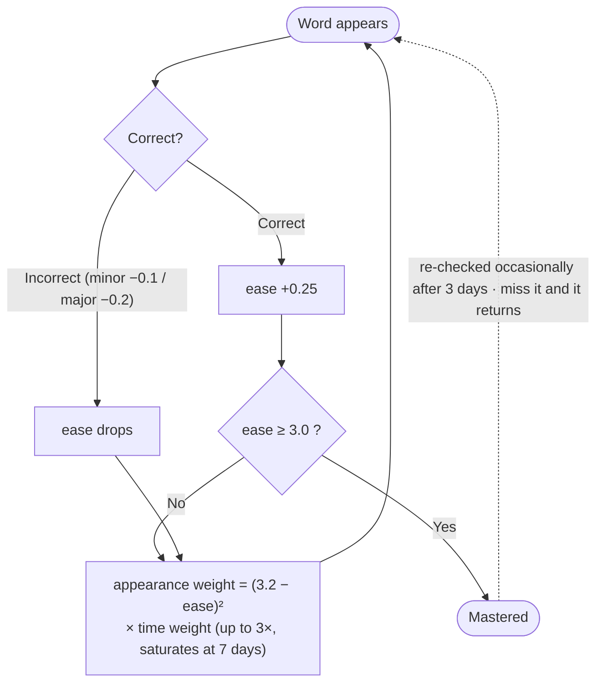

# TypeSee

<p align="center">
  <a href="https://nextjs.org/"></a>
  <a href="https://react.dev/"></a>
  <a href="https://www.typescriptlang.org/"></a>
  <a href="https://supabase.com/"></a>
  <a href="https://vitest.dev/"></a>
  <a href="https://type-see.vercel.app"></a>
</p>

<p align="center"><b>Type and Learn</b> — an English vocabulary app that makes words stick by typing them.</p>

<p align="center"><a href="https://type-see.vercel.app">type-see.vercel.app</a></p>

<p align="center">English · <a href="README.md">한국어</a></p>

## Table of Contents

- [Overview](#overview)
- [Core Features](#core-features)
  - [The TS-1 Algorithm](#the-ts-1-algorithm)
- [Tech Stack](#tech-stack)
- [Project Structure](#project-structure)
- [Getting Started](#getting-started)
- [History](#history)

## Overview

- Learn words through three modes — **Typing / Quiz / Listening**: see and type, recall the spelling from the meaning alone, or transcribe from pronunciation alone.
- Every word comes with an example sentence and its Korean translation so words are learned in context, and any word you miss is automatically collected into a review note.
- **My Words**: add any word you like and Gemini generates its definition and example sentence, so you can build a vocabulary list of your own (signed-in users only).
- The streak calendar on the home screen shows your day-by-day history, and WPM and error rate are displayed live during a session.
- Smaller conveniences round it out: text-to-speech pronunciation, keyboard-only operation, a mobile-responsive layout, and forced English input even when the Korean IME is switched on.

## Core Features

### The TS-1 Algorithm

**A custom algorithm that decides how often a missed word comes back.**

SM-2 (SuperMemo-2) and FSRS were both evaluated first, but each schedules reviews by calendar date and
therefore assumes you show up every day. To serve users who drop in every few days instead, **TS-1** was
designed from scratch so that the app behaves sensibly no matter how often you visit.

**In one line**: every word carries an `ease factor` (1.3–3.0), and the lower it is (the more often you miss the word), the more frequently that word appears in a session.



| Situation | Ease change | Notes |
|---|---|---|
| Correct (clean) | `+0.25` | Graduates once it reaches 3.0, the mastery threshold |
| Incorrect — minor (typo before the correct key, hint used) | `−0.1` | |
| Incorrect — major (never got it, revealed the answer) | `−0.2` | |
| Floor | `1.3` | No matter how often you miss it, ease never drops below this |

- **Time weighting**: a word you haven't seen in a while becomes up to 3× more likely to appear (saturating at 7 days), which mimics the spacing effect without any date-based schedule.
- **Mastery re-checks**: crossing the threshold doesn't remove a word for good — it reappears occasionally starting three days later to confirm you still remember it, and returns to the review pool if you miss it.
- **Cooldown**: a word you just got right sits out the very next session, so it never comes back immediately after a correct answer.

**SM-2 vs FSRS vs TS-1**

| | Strengths | Weaknesses |
|---|---|---|
| **SM-2** | Proven spaced repetition with strong long-term retention per unit of effort. | Date-based scheduling assumes daily visits. Miss a few days and overdue reviews pile up. |
| **FSRS** | Learns per-user intervals from a memory model (difficulty, stability, recall probability), matching SM-2's efficiency with fewer reviews. | Still date-based, so the daily-visit assumption remains. Needs data to fit its parameters and is more complex to implement. |
| **TS-1** | Independent of visit frequency. Whenever you come back there is no overdue backlog — the weakest words simply surface first, probabilistically. | Its time-based spacing effect is weaker than SM-2/FSRS, so the same word can recur at short intervals (mitigated by the cooldown). |

## Tech Stack

| Area | Technology |
|---|---|
| Framework | Next.js 16 (App Router) · React 19 · TypeScript |
| Compiler | React Compiler (babel-plugin-react-compiler) |
| Animation | Motion |
| Backend | Supabase — auth (email/password · Google · GitHub) and study-history storage ([`supabase/schema.sql`](supabase/schema.sql)) |
| AI | Gemini API (`gemini-3.1-flash-lite`) — generates definitions and examples for My Words (`app/api/generate-word`) |
| Styling | CSS Modules — one stylesheet per screen |
| Testing | Vitest — session engine and TS-1 algorithm (`npm test`) |
| Deploy / Analytics | Vercel · Vercel Analytics |

## Project Structure

```
src/
  app/
    api/generate-word/       # Gemini-backed My Words generation API
    _brand/                  # Wordmark component and fonts for favicon / OG image
    apple-icon.tsx, icon.tsx, opengraph-image.tsx  # Favicon · link-share preview
    layout.tsx, page.tsx     # Next.js entry points
  App.tsx                    # Screen flow (Home → Session → Result → Review)
  lib/
    engine.ts                # Session reducer and statistics (pure functions)
    types.ts                 # Shared types (WordEntry, SessionState, etc.)
    wordMatch.ts             # Locates the headword inside an example (inflection / derivation matching)
    auth.ts                  # Supabase authentication
    supabase.ts / supabaseAdmin.ts  # Supabase clients (browser / server)
    tts.ts                   # Word pronunciation
    inAppBrowser.ts          # Detects in-app browsers (KakaoTalk, etc.)
    prefs/                   # Home and session preferences (difficulty, auto-advance, ...)
    stores/                  # Study state stores (review pool, streak, My Words)
  screens/                   # Home · Session · Result · Review · MyWords
    overlays/                # AuthSheet · HistorySheet · StreakCalendar
  data/                      # Word data (wordjson.json + index.ts)
  styles/global.css          # Global styles
```

Branches: `hyeong-dev-v1` is the archived v1 build.

## Getting Started

```bash
npm install
npm run dev     # http://localhost:3000
npm test        # Vitest — session engine and TS-1 algorithm
npm run build   # Production build
```

Environment variables (`.env.local`):

| Variable | Purpose |
|---|---|
| `NEXT_PUBLIC_SUPABASE_URL` | Supabase project URL |
| `NEXT_PUBLIC_SUPABASE_ANON_KEY` | Supabase anon key (browser client) |
| `SUPABASE_SERVICE_ROLE_KEY` | Supabase service-role key (server client) |
| `GEMINI_API_KEY` | Gemini API key for My Words generation |
| `GEMINI_MODEL` | Optional — overrides the default `gemini-3.1-flash-lite` |

The app runs without Supabase or Gemini credentials in guest mode; sign-in and My Words require them.

## History

<details>
<summary>Expand the milestone log</summary>

- **2026.07.27** — GitHub sign-in wired into Supabase OAuth alongside Google.
- **2026.07.24** — Source folders reorganized by concern; app-wide switch to the RIDIBatang typeface; link-share preview image and icons added.
- **2026.07.20** — Major word-data cleanup: contamination, noise, and example/headword mismatches resolved, settling at 8,094 curated words.
- **2026.07.17** — Merged the fully translated word set (8,443 entries) and added four more part-of-speech tags.
- **2026.07.16** — Category system reworked into four TOEIC tiers plus everyday, business, and science; data source switched to wordjson.
- **2026.07.15** — My Words launched, with Gemini generating definitions and examples; misses split into three tiers (clean/minor/major) for finer ease adjustment.
- **2026.07.14** — Listening (dictation) mode added; Google sign-in integrated; TS-1 gained time weighting and mastery re-checks.
- **2026.07.13** — TS-1 algorithm implemented; Vitest test suite introduced; every screen redesigned around a paper-and-ink light theme.
- **2026.07.12** — Study streak calendar added; mobile responsive layout reworked.
- **2026.07.05** — Example sentences embedded into the session card, later joined by Korean translations.
- **2026.07.02** — Project started, then rebuilt from v1 into v2 with performance and design reworked from the ground up.

</details>
