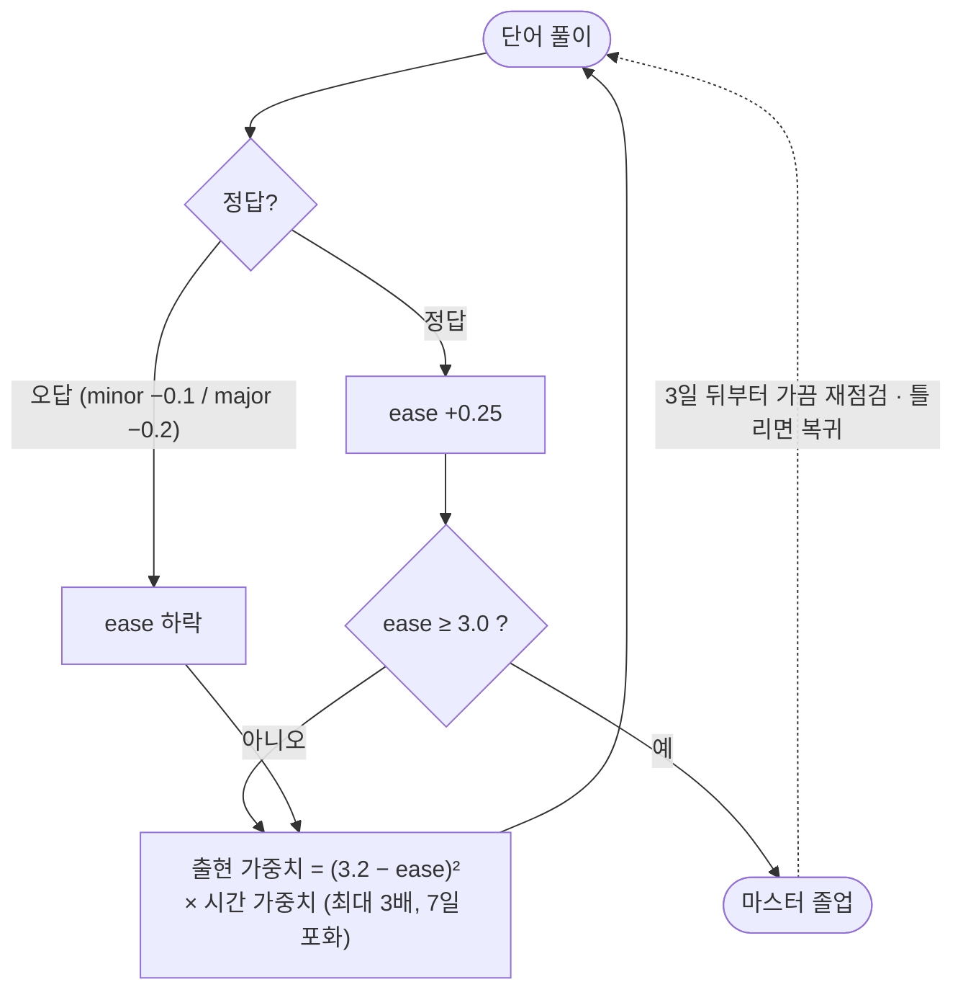

# TypeSee

<p align="center">
  <a href="https://nextjs.org/"></a>
  <a href="https://react.dev/"></a>
  <a href="https://www.typescriptlang.org/"></a>
  <a href="https://supabase.com/"></a>
  <a href="https://vitest.dev/"></a>
  <a href="https://type-see.vercel.app"></a>
</p>

<p align="center"><b>Type and Learn</b> — 타이핑하며 눈에 새기는 영단어 앱.</p>

<p align="center"><a href="https://type-see.vercel.app">type-see.vercel.app</a></p>

## 목차

- [소개](#소개)
- [핵심 기능](#핵심-기능)
  - [TS-1 알고리즘](#ts-1-알고리즘)
- [기술 스택](#기술-스택)
- [폴더 구조](#폴더-구조)
- [히스토리](#히스토리)

## 소개

- **Typing / Quiz / Listening** 세 모드로 단어를 익힙니다: 보고 치기, 뜻만 보고 철자 떠올리기, 발음만 듣고 받아쓰기.
- 단어마다 예문과 한글 해석을 함께 보여줘 문맥으로 학습할 수 있고, 틀린 단어는 자동으로 복습 노트에 쌓입니다.
- **내 단어장**: 원하는 단어를 추가하면 Gemini가 뜻·예문을 생성해줘 나만의 단어장을 만들 수 있습니다 (로그인 전용).
- 홈 화면의 학습 스트릭 캘린더로 날짜별 기록을 확인할 수 있고, 세션 중에는 WPM·오답률이 실시간으로 표시됩니다.
- 단어 발음(TTS), 키보드 온리 조작과 모바일 반응형, 한글 IME가 켜져 있어도 영어를 강제 입력해주는 등 자잘한 편의 기능도 갖췄습니다.

## 핵심 기능

### TS-1 알고리즘

**오답 단어를 얼마나 자주 다시 보여줄지 정하는 자체 알고리즘.**

SM-2(SuperMemo-2)와 FSRS 도입을 먼저 검토했지만, 둘 다 "매일 접속"을 전제로 한 날짜 기반
스케줄이라 가끔 들어오는 유저에겐 맞지 않았습니다 — 며칠 쉬면 밀린 복습만 잔뜩 쌓이는 식이죠.
그래서 접속 빈도에 상관없이 항상 자연스럽게 동작하는 **TS-1**을 직접 고안했습니다.

**한 줄 요약**: 단어마다 `ease factor`(1.3~3.0)를 매기고, 낮을수록(자주 틀릴수록) 세션에 더 자주 등장시킵니다.



| 상황 | ease 변화 | 비고 |
|---|---|---|
| 정답 (클린) | `+0.25` | 3.0(마스터 기준선)에 닿으면 졸업 |
| 오답 — minor (정타 전 오타·힌트) | `−0.1` | |
| 오답 — major (끝까지 오답·정답 보기) | `−0.2` | |
| 하한선 | `1.3` | 아무리 틀려도 이 아래로는 안 내려감 |

- **시간 가중치**: 오래 안 본 단어는 출현 확률이 최대 3배까지 오르며(7일 만에 포화), 날짜 스케줄 없이도 간격 효과(spacing effect)를 흉내 냅니다.
- **마스터 유지 점검**: 임계값을 넘겨 졸업해도 완전히 사라지지 않고, 3일 뒤부터 가끔 재등장해 여전히 기억하는지 확인합니다 — 틀리면 다시 복습 풀로 복귀.
- **쿨다운**: 방금 맞힌 단어는 바로 다음 세션에서 한 번 쉬어, 맞히자마자 곧바로 또 나오지 않게 합니다.

**SM-2 vs FSRS vs TS-1**

| | 장점 | 단점 |
|---|---|---|
| **SM-2** | 검증된 간격 반복(spaced repetition)으로 장기 기억 효율이 높음. | 날짜 기반 스케줄이라 매일 접속을 전제로 함. 며칠 놓치면 밀린 복습이 쌓임. |
| **FSRS** | 기억 모델(난이도·안정성·회상 확률) 기반으로 유저별 최적 간격을 학습, SM-2보다 적은 복습으로 같은 효율. | 여전히 날짜 기반이라 매일 접속 전제는 동일. 파라미터 학습에 데이터가 필요하고 구현이 복잡. |
| **TS-1** | 접속 빈도와 무관. 언제 들어와도 밀린 복습 없이 약한 단어부터 확률적으로 등장. | 시간 기반 간격 효과가 SM-2/FSRS보다 약해 같은 단어가 짧은 간격으로 반복될 수 있음 (쿨다운으로 보완). |

## 기술 스택

| 영역 | 기술 |
|---|---|
| 프레임워크 | Next.js 16 (App Router) · React 19 · TypeScript |
| 컴파일러 | React Compiler (babel-plugin-react-compiler) |
| 애니메이션 | Motion |
| 백엔드 | Supabase — 인증(아이디/비밀번호 · Google) + 학습 기록 저장 ([`supabase/schema.sql`](supabase/schema.sql)) |
| AI | Gemini API (`gemini-3.1-flash-lite`) — 내 단어장 뜻·예문 자동 생성 (`app/api/generate-word`) |
| 스타일 | CSS Modules — 화면별 스타일 |
| 테스트 | Vitest — 세션 엔진 · TS-1 알고리즘 (`npm test`) |
| 배포/분석 | Vercel · Vercel Analytics |

## 폴더 구조

```
src/
  app/
    api/generate-word/       # Gemini 기반 내 단어장 생성 API
    _brand/                  # 파비콘·OG 이미지용 워드마크 컴포넌트·폰트
    apple-icon.tsx, icon.tsx, opengraph-image.tsx  # 파비콘 · 링크 공유 미리보기
    layout.tsx, page.tsx     # Next.js 엔트리
  App.tsx                    # 화면 전환 (홈 → 세션 → 결과 → 복습)
  lib/
    engine.ts                # 세션 리듀서·통계 (순수 함수)
    types.ts                 # 공용 타입 (WordEntry, SessionState 등)
    wordMatch.ts             # 예문 속 표제어 위치 찾기 (굴절형·파생어 매칭)
    auth.ts                  # Supabase 인증
    supabase.ts / supabaseAdmin.ts  # Supabase 클라이언트 (브라우저 / 서버)
    tts.ts                   # 단어 발음
    inAppBrowser.ts          # 인앱 브라우저(카카오톡 등) 감지
    prefs/                   # 홈·세션 설정 저장 (난이도·자동 넘김 등)
    stores/                  # 학습 상태 저장소 (복습 풀·스트릭·내 단어장)
  screens/                   # Home · Session · Result · Review · MyWords
    overlays/                # AuthSheet · HistorySheet · StreakCalendar
  data/                      # 단어 데이터 (wordjson.json + index.ts)
  styles/global.css          # 전역 스타일
```

브랜치: `hyeong-dev-v1` = 구버전(v1) 백업.

## 히스토리

<details>
<summary>전체 변경 기록 펼치기</summary>

- 2026.07.24 - 코드 폴더를 기능별(설정값·저장소·팝업 화면)로 재정리해 정돈, 예전 단어 데이터 파일을 정리하고 예문 속에서 단어를 더 정확히 찾아 빈칸 처리하는 로직 개선, 일상 단어 47개 추가, 앱 전체 서체를 손글씨 느낌의 RIDIBatang으로 교체, 링크 공유 시 뜨는 미리보기 이미지·아이콘 추가(배포 용량 오류도 함께 해결).
- 2026.07.20 - 단어 데이터 대정리: 0-400 등급 오염 제거, 잡음·고유명사 337개 삭제, 예문-표제어 불일치 해소, 속어·일상용어 재분류로 8,094개로 정리.
- 2026.07.20 - 세션 예문 가독성 개선(줄폭 52자·balance 정렬·대비 강화), 표제어가 포함된 예문만 선택하도록 필터, 오답 시 정답 칩을 단어칸 위 스택으로 표시.
- 2026.07.17 - 홈 화면 카테고리·단어 수 선택을 localStorage에 백업해 유지, AnimatePresence 다중 자식 경고 수정.
- 2026.07.17 - 전량 번역된 wordjson 병합으로 단어 8,443개 확장(중복 234개·저품질 항목 정리), 품사 표기 4종 추가(대명사·접속사·한정사·조동사).
- 2026.07.16 - 카테고리 체계 개편(토익 4단계·일상·비즈니스·과학)과 wordjson 데이터 소스 전환, 단어리스트 리뉴얼·품사 표기·내 단어장 모두 지우기, 예문이 여러 개면 카드에 랜덤 표시, 게스트 모드 Note 비활성화·복습 풀 localStorage 백업 제거.
- 2026.07.15 - Quiz/Listening 카드 최소 크기 고정, Gemini 3.1 Flash-lite 기반 내 단어사전 추가.
- 2026.07.15 - 난이도별(퀴즈/리스닝) 채점 타이밍 분리(보통·어려움은 완료 시점에만 정오답 공개), 오답 3단계(clean/minor/major) 분류로 EF 세분화, 인앱 브라우저(카카오톡 등) Google 로그인 안내, 내 단어장 잘못된 입력 필터링·단축키·최대 100개로 확장, 홈 화면 카드 높이·스크롤·로그인 잠금 배지 정리.
- 2026.07.14 - 복습 세션을 노트 세션으로 명칭 변경 + UI 개선, Quiz/Listening 힌트·정답 보기 기능, EF 수치 제거·저장/틀림 배지 분리·상태 칩·숫자 단축키·익힘 단계 색상 라벨.
- 2026.07.14 - Google 로그인 연동, 리스닝 카드에 예문 문장 표시, 크롬에서 TTS가 안 나오던 버그 수정.
- 2026.07.14 - TS-1 시간 가중치·마스터 유지 점검 추가, Listening(받아쓰기) 모드, EF 디버그 배지를 익힘 단계 점 표시로 교체, 게스트 ease 진행분 새로고침 증발 버그 수정.
- 2026.07.13 - TS-1 알고리즘 구현, 게스트 데이터 localStorage 백업, 한글 IME 영어 강제 입력, vitest 테스트 도입, 죽은 힌트 로직 제거.
- 2026.07.13 - 종이와 잉크 컨셉 라이트 테마로 전체 화면 리디자인.
- 2026.07.12 - 모바일 반응형 개선, 퀴즈 오답 즉시 표시, 학습 스트릭 캘린더 추가.
- 2026.07.07 - 예문 한글 해석·저장 단어 표시 추가, 결과 지표를 정확도에서 오답률로 변경.
- 2026.07.05 - 예문 임베드, 스페이스 저장/스킵, 복습 목록·세션 카드 UX 개선.
- 2026.07.03 - 단어 500개 추가, 예문 필드 추가, 로그아웃 시 틀린 단어 초기화 버그 수정.
- 2026.07.02 - 프로젝트 시작, v1 개발 후 성능·디자인을 재설계한 v2로 개편.

</details>
